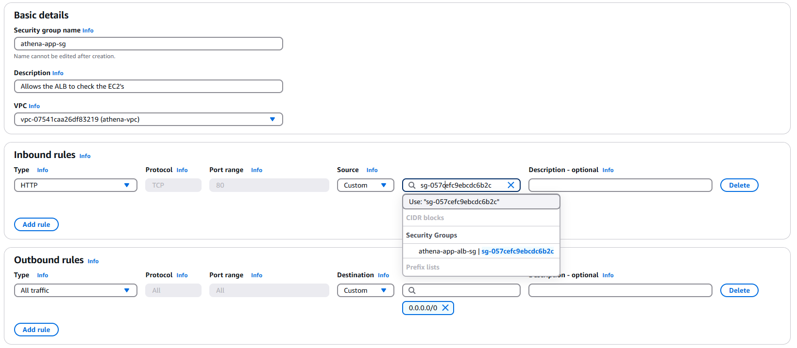
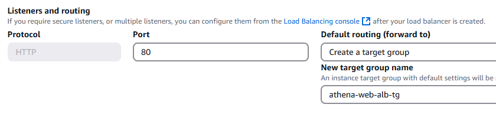

# Athena 3-Tier Architecture Project 

# Intro
When building a modern cloud application, there are many key considerations such as security, availability, and scalability. This project showcases a manually constructed 3-tier architecture emphasizing secure auto scaling, network segmentation, and internal service communication. Built from scratch without IaC tools to focus on foundational services such as VPC, IAM, EC2, RDS, and SSM to make sure each service runs independently and tightly integrated. This documentation provides a clear step by step on how to manually build including setup decisions, user data scripts, and testing procedures.

A 3-tier architecture tackles modern cloud challenges by separating concerns across three distinct layers:

- Web Tier (Presentation Layer): The front-facing component where users interact with the application.
- App Tier (Logic Layer): The backend, responsible for business logic, authentication, and application processing.
- Database Tier (Persistence Layer): The secure vault that stores sensitive data such as user credentials, session tokens, and transaction history.

By distributing these tiers across multiple Availability Zones (AZs) and isolating them using subnets and security groups, this architecture achieves high availability, fault tolerance, and tight security boundaries, which adheres to AWS best practices.

# Architecture Design
 


# Virtual Private Cloud (VPC)
The architecture needs a solid private and isolated foundation before it can run. A VPC is required which will be the base environment for the 3-tier to run in. This isolates our environment from the public internet, it ensures privacy so that our resources can run in a secure environment. 
- Requirements: 
    - Two (2) Public Subnets to host the Web Tier
    - Two (2) Private Subnets for the App Tier 
    - Two (2) Private Subnets for the Database Tier
    - One (1) Internet Gateway (IGW) for public internet access
    - One (1) NAT Gateway to allow internet access for App and Database Tier 
    - One (1) Public route table for Internet Gateway 
    - One (1) Private route table for NAT Gateway 


# VPC Steps 
- Most of this can be auto-generated using the AWS VPC wizard as shown below. 


- I named my VPC “Athena” after the goddess of wisdom and warfare, very fitting for something like cloud infrastructure where resilience, precision, and strategy matters.
- There are 6 subnets total, split across 3 tiers (web, app, database) so 2 subnets for each tier. This gives us logical isolation and high availability. 
- Technically you only need 1 private route table to connect all 4 private subnets to the NAT gateway but by default AWS wizard creates 4 private route tables for each private subnets. It’s optional to delete the 3 and have one private route table.
- It's important to enable auto-assign public IPv4 address for the public subnets. Without this, EC2 instances launched in public subnets won’t be reachable from the internet, even if the internet gateway is attached. They’d behave like private instances.

- That concludes the VPC setup.


# Security Groups 
- I always like to start with the security groups, instead of creating them on the spot. This way, we can just insert them during our build.
- There will be Five (5) security groups: 
    - athena-web-alb-sg : Allows public HTTP/HTTPS traffic to the Web ALB.
    - athena-web-sg : Accepts HTTP from athena-web-alb-sg only.
    - athena-app-alb-sg : Accepts HTTP from athena-web-sg (Web Tier to App ALB). 
    - athena-app-sg : Accepts HTTP from athena-app-alb-sg (App ALB to App EC2s).
    - athena-data-sg : Accepts MySQL (3306) from athena-app-sg only.
- We start with our athena-web-alb-sg. Inbound rule to allow HTTP/HTTPS on port 80/443 to 0.0.0.0/0 (Anywhere).

- Now let's continue with our athena-web-sg. As shown above, it's critical to allow inbound rule HTTP on port 80 with a custom source using our athena-web-alb-sg. This ensures that our ALB is only accessible using the ALB DNS and eliminates connection using the public IP’s from our public EC2’s. 

- This SG allows our Web Tier to connect with the app and for DNS testing, the inbound rule is HTTP on port 80 with a custom source to our athena-web-sg.

- The athena-app-sg needs to allow inbound HTTP from athena-app-alb-sg.

- Our data should only communicate with our app tier, to do so. We must allow inbound rule MySQL on port 3306 with a custom source using our athena-app-sg.

- Outbound rules are left as default (all traffic), since our tiers initiate responses, fetch updates, and communicate across services.


# IAM Role
- For our build, we will not use SSH on port 22. Instead a better practice is to use SSM (Systems Manager). Why? It doesn’t need SSH access, its secure, logged, portless and as long as the subnet has Internet Gateway or VPC Endpoint, it works. 
- Search IAM role in the console. We will select AWS service with EC2. This allows our EC2 to access the SSM service for secure remote access and Cloudwatch Agent for future monitoring. 

- We will then add the necessary permissions, AmazonSSMManagedInstanceCore and CloudWatchAgentServerPolicy. For the name, I used “athena-ops-role” since its operations based. 


- CloudWatch is included in case we decide to implement monitoring later on. 


# Web Tier Requirements 
- A web server launch template to define what kind of EC2 instances will be provisioned for the web.
- An Auto Scaling Group (ASG) that will dynamically provision EC2 instances.
- An Application Load Balancer (ALB) to help route incoming traffic to the proper targets.


# Web Tier Steps 
- We are now ready to start our web tier. But first we must create our web server launch template and it will be used by our ASG to dynamically launch EC2 instances in our public subnets. In the console, search for launch template and it should be under EC2 feature. 
- I named my web server launch template “athena-web-lt”. Under “Application and OS Images (Amazon Machine Image)”, proceed to quick start and select “Amazon Linux 2 AMI” with an instance type of t3.micro. There’s no requirement for a key, we’ll be using an SSM instead of SSH for better security. 
- On network settings, you can skip specifying a subnet since the Auto Scaling Group will handle subnet placement. But here, we will use the security group athena-web-sg that we created prior. 

- Under advanced detail, here we will add our IAM role that we created prior. This allows our web ec2 instances to have access with SSM remote connection and CloudWatch monitoring. 

- Use the following user data script to bootstrap the web EC2 instances: **[here](./userdata_scripts/web_userdata.sh)**
- And that concludes the web tier launch template.
- Let's proceed with the Auto Scaling Group (ASG), which ensures high availability. It automatically provisions EC2 instances across our public subnets as needed. 
- Navigate through the ASG console using the search bar. I named my ASG “athena-web-asg” and we will select the athena-web-lt that we created for the launch template. 
- Under network settings, we must include our athena vpc along with our 2 public subnets. 

- ALB (Application Load Balancer) is critical here as it is needed to evenly distribute traffic to our EC2 instances. I named mine athena-web-alb with internet facing as it allows it to listen to HTTP/HTTPS.

- A target group is required to distribute the load on our instances and listen to HTTP on port 80. 

- The health check is important, It should be enabled. Health checks increase availability by monitoring instance health and automatically replacing any unhealthy instances. It also shows if your web is reachable, it checks the path (index.html) to see if it has one running.
- For the group size, we want a desired capacity of 2, a minimum of 2 and a max of 5. This ensures high availability because 2 instances will be running. If one instances messes up, a backup is available. If it requires additional instances then it can scale up to 5 instances. 

- Under additional settings, there is an option to enable group metrics using CloudWatch, it's optional but I highly recommend enabling it. It gives us birds eye view for high observability and faster troubleshooting since we’re maintaining multi instances. 
- Review the ASG and create the group. This concludes the Web Tier setup.
- Before we test it, the ASG wizard by default auto-assign the athena-web-sg that we added on our launch template to our web-alb. So we must change the security group to use the athena-alb-sg instead of the athena-web-sg in our ALB console. 
- To do so, navigate to the ALB console, under security we are able to edit the security group.

- Once we update the security group of our ALB from default athena-web-sg to athena-alb-sg then we can copy the DNS and paste it in our web browser. 
- You should see the message “Hello from Athena Web Tier” along with the private IP of the responding instance. If we refresh it, we should see the second IP, and this validates that the application load balancer is working and evenly distributing traffic. 

- We have successfully finished creating our web tier. This is the presentation layer, where the users will interact. 

# App Tier Requirements 
- An app launch template to define the type of EC2 instances.
- An Auto Scaling Group (ASG) to dynamically provision EC2 instances.
- An Application Load Balancer (ALB) to route traffic from the Web tier.
- A Systems Manager (SSM) to securely connect to our application servers.

# App Tier Steps 
- Now that our Web Tier is healthy and reachable via ALB, let’s build up the App Tier, which is the brain of our architecture. The logic and computation happens here,  the core operations to send/retrieve data to/from the Web and Data Tier. We will follow the same steps as our Web Tier with a few adjustments.
- Let's create the application launch template “athena-app-lt” with the same settings as our web launch template (Amazon Linux 2 AMI, t3.micro, IAM athena-ops-role) which will allow us to connect from our Web to App Tier for testing and ops work using Systems Manager (SSM) and attach the athena-app-sg for the security group.

- The user data is also different, we will have a script to download MySQL as it is needed to communicate with our database later. We will create a new path for the index layer as well. Use the provided user data script here: **[here](./userdata_scripts/app_userdata.sh)**
- So now for the Auto Scaling Group (ASG), similar to the Web Tier, we’ll create an ASG using our athena-app launch template. We’ll add the athena VPC and our 2 private subnets (athena-subnet-private1 and athena-subnet-private2).

- Now we’ll create another Application Load Balancer (ALB) that routes traffic from our Web Tier to our App Tier. We’ll name it “athena-app-alb”.
- It will not be internet facing this time, it’ll be internal, since we’ll be routing traffic internally through our Web Tier, not the internet.

- There will be another target group to connect to our private app EC2 instances with our load balancer. 

- The group size remains the same as our Web Tier (desired capacity of 2, min of 2 and max of 5) with a target tracking policy at 75% of CPU utilization.
- Okay we just finished creating our App Tier ALB. Let's change the Security group of it to our athena-app-alb-sg since by default it uses our athena-app-sg.

- Since we created a new path within our user data boot strap script. We’ll have to change the health check from our target group to /app/index.html 

- We wont be able to use our browser to test our app since it's internal access. Now this is where SSM truly shines, it's portless, automatic logging, and secure remote connection which aligns with AWS best practices.
- From our EC2 instances, let's copy the instance ID of one of our web instances. Search Systems Manager (SSM), on the left side bar, select session manager. Click on start a session, it's optional to add a reason but I put “Admin”. For the target instance, paste the instance ID and let's open a session. 

- Okay let's go back to our athena-app-alb and copy the DNS which will be used to test our connection if our app is working. 

- Let's use the curl command with the copied DNS with the correct path for testing: 

- ```curl (copied DNS)/app/index.html```


- That’s it! We’re done with our App Tier. Optionally with SSM since it's portless, you’re able to start a session with your private App Tier instances. 

# Database Tier

- We are on the last stage of our architecture. Every application needs a database which is a way to store important data such as user login info, session data, transactions, etc. We have the Web Tier as the pretty face, App as the brain and now the Database will become the secret vault.
- We’ve already created the security group for the database so let's proceed with the database subnet group. Search “Aurora and RDS” and on the left side bar, select subnet groups.
- Make sure to select our athena VPC, along with the correct “us-east-1a and us-east-1b” availability zones with our last private subnets 3 and 4. 

- Now let's create the database, and AWS offers several types of databases but for this project we are going to proceed with MySQL RDS Database. 

- In a production environment, it's best practice to have a standby RDS database for high availability. Only caveat is that the standby endpoint sits idle, there’s no read scaling. Optionally for testing purposes, you could use a single-AZ DB instance deployment. 

- For the identifier, I named it “athena-database”. As for the credentials settings, we’ll proceed with self managed password.

- The instance configuration we’ll use burstable classes with db.t3.micro.

- We’ll choose “General Purpose SSD (gp2)” for the storage type with 20 GiB allocated storage. 

- For the connectivity, we do not want to connect to an EC2 instance but make sure you attach the athena VPC as well as the security group for our database and the subnet group we created. 


- Under additional configuration, let's create the name and leave everything else as default. 

- The database takes a while to create but after the database has been created, lets connect to it and do a test to make sure everything works as expected. First we’ll copy the reader endpoint then we’ll use SSM for this testing using any of our private app instances. 

- We should already have our MySQL installed with our boot strap script for the App Tier. We’ll use this command to connect to our database: 

- ```mysql -h <YOUR_DB_ENDPOINT> -u <YOUR_DB_USERNAME> -p```

- You will be prompted to enter a password, enter the password you chose when we created the database.

- Additionally you could use this command to see your database: 
- ```show database;```
- We’ve successfully connected to the database from our App Tier instance.

# Conclusion

- There were a lot of steps, but with this, we have created a resilient, highly available, scalable, and secure 3-tier infrastructure that follows AWS best practices.
- This concludes the manual deployment of Athena’s 3-tier architecture. All layers (Web, App, DB) were independently deployed, securely interconnected, and verified through SSM and MySQL connection tests. Remember to delete all of your resources when you’re done to avoid future costs.